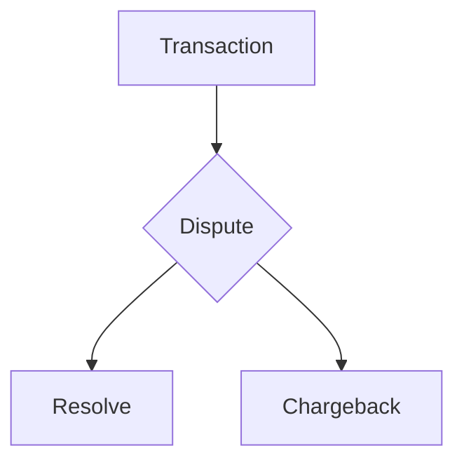

## Rust Coding Test
To run: `cargo run -- input_filename.csv > output_file.csv`

To run test cases: `cargo test`
##

In my solution I make the following assumptions:

  

1. Different logic is required to dispute a Withdrawal vs a Deposit

2. A Dispute can end up as **either** a Resolve **or** a Chargeback, but not both in succession.

  E.g.

Transaction data is streamed in 8kb at a time through a `BufReader` then processed record-by-record in a single loop. 

I use a `Client` struct to handle data about each account - within that struct I store a `Vec<Transaction>` to track transactions for that client.

Client data is accumulated in a `HashMap<u16, Client>` until we are finished processing the transaction records, at which point it is Serialized back into .csv format and written to STDOUT. 

|Category | Description| Notes |
|---------|------------|-------|
|Basics   |Does your application build? Does it read and write data in the way we'd
like it to? Is it properly formatted?| yes |
Completeness Do you handle all of the cases, including disputes, resolutions, and
chargebacks? Maybe you don't handle disputes and resolutions but you
can tell when a transaction is charged back. Try to cover as much as you
can
Correctness For the cases you are handling are you handling them correctly? How do
you know this? Did you test against sample data? If so, include it in the
repo. Did you write unit tests for the complicated bits? Or are you using the
type system to ensure correctness? Tell us about it in the README
Safety and
Robustness
Are you doing something dangerous? Tell us why you chose to do it this
way. How are you handling errors?
Efficiency Be thoughtful about how you use system resources. Sample data sets may
be small but you may be evaluated against much larger data sets (hint:
transaction IDs are valid u32 values). Can you stream values through
memory as opposed to loading the entire data set upfront? What if your
code was bundled in a server, and these CSVs came from thousands of
concurrent TCP streams?
Maintainability In this case clean code is more important than efficient code because
humans will have to read and review your code without an opportunity for
you to explain it. Inefficient code can often be improved if it is correct and
highly maintainable.
