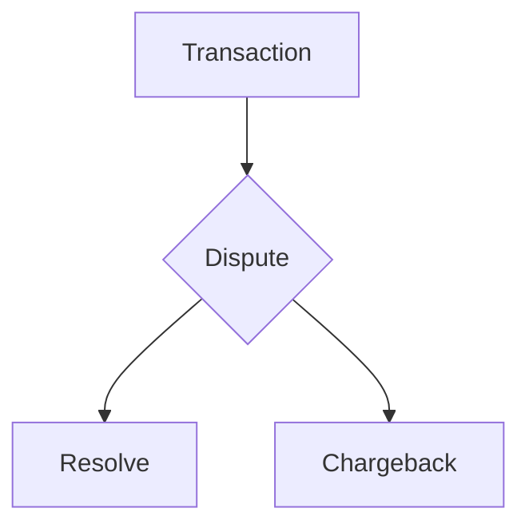

## Rust Coding Test
To run: `cargo run -- input_filename.csv > output_file.csv`

To run test cases: `cargo test`
##

### In my solution I make the following assumptions:

#### 1. Different logic is required to dispute a Withdrawal vs a Deposit
- Deposits would require Dispute logic as outlined in the requirements:
>the clients available funds should decrease by the amount disputed, their held funds should increase by the amount disputed
- Withdrawals would require **Dispute** logic as follows (reversing a **Withdrawal** would probably require a refund):

>the clients held funds should increase by the amount disputed (potential refund) and their total funds would also reflect this.

#### 2. A Dispute can end up as **either** a Resolve **or** a Chargeback, but not both.

E.g.

#### 3. Once a client account is frozen, they can't process any further transactions. Any subsequent transactions after a Chargeback are ignored.
- This seemed like a logical choice, maybe we'd manually unlock their account after reviewing the activity.

#### 4. A transaction cannot be re-disputed once resolved or charged back
- This also seemed like a logical decision, since I'm assuming both parties would have reached a resolution with either a **Resolve** or a **Chargeback**.

Transaction data is streamed in 8kb at a time through a `BufReader` then processed record-by-record in a single loop. 

I convert the floating point values in the input file (deserialized into `f64`) into `u64` to avoid any floating point errors, then back into `f64` when it's time to serialize the output.

I use a `Client` struct to handle data about each account - within that struct I store a `Vec<Transaction>` to track transactions for that client.

Client data is accumulated in a `HashMap<u16, Client>` until we are finished processing the transaction records, at which point it is Serialized back into .csv format and written to STDOUT. 

## Scoring

| Category|Description|Notes|
|----------------|-------------------------------|-----------------------------|
|Basics|Does your application build? Does it read and write data in the way we'd like it to? Is it properly formatted?|Yes, I believe so!|
|Completeness          |Do you handle all of the cases, including disputes, resolutions, and chargebacks? Maybe you don't handle disputes and resolutions but you can tell when a transaction is charged back. Try to cover as much as you can.|Yes, I've attempted to handle each type of transaction!|
|Correctness |For the cases you are handling are you handling them correctly? How do you know this? Did you test against sample data? If so, include it in the repo. Did you write unit tests for the complicated bits? Or are you using the type system to ensure correctness? Tell us about it in the README|Yes, based on my assumptions, see above. I also have written simple positive and negative test cases (`./test_data`) and unit tests for each, `./src/components/test.rs`
|Safety and Robustness| Are you doing something dangerous? Tell us why you chose to do it this way. How are you handling errors? | No `unsafe` code here! I am using the `Result` enum to handle errors and propagate them so they can be logged or tracked if necessary. I've strived to make the nuts and bolts of this assignment fairly atomic so they can be moved around or re-used. 
|Efficiency|Be thoughtful about how you use system resources. Sample data sets may be small but you may be evaluated against much larger data sets (hint: transaction IDs are valid u32 values). Can you stream values through memory as opposed to loading the entire data set upfront? What if your code was bundled in a server, and these CSVs came from thousands of concurrent TCP streams?| Currently this project streams transaction data in 8kb chunks from the input file and processes records one-by-one in a single loop. See `./src/components/utilities.rs -> process_transaction_data()`, I think the current time complexity should be ~O(n). The source we are using could be modified to use a `TcpStream` instead of a file.
| Maintainability | In this case clean code is more important than efficient code because humans will have to read and review your code without an opportunity for you to explain it. Inefficient code can often be improved if it is correct and highly maintainable.| I strive to use Rust best practices and leave comments where I feel it is necessary. I like to split up files into different modules where it makes sense to me!