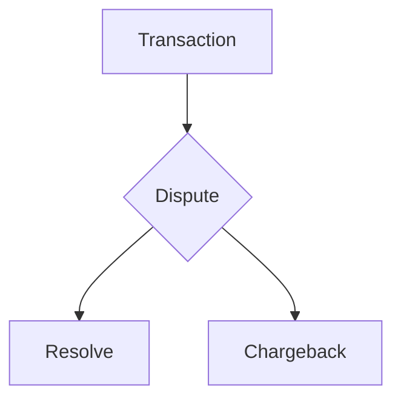

## Rust Coding Test
To run: `cargo run -- input_filename.csv > output_file.csv`

To run test cases: `cargo test`
##

In my solution I make the following assumptions:

  

1. Different logic is required to dispute a Withdrawal vs a Deposit

2. A Dispute can end up as **either** a Resolve **or** a Chargeback, but not both in succession.

  E.g.

Transaction data is streamed in 8kb at a time through a `BufReader` then processed record-by-record in a single loop. 

I use a `Client` struct to handle data about each account - within that struct I store a `Vec<Transaction>` to track transactions for that client.

Client data is accumulated in a `HashMap<u16, Client>` until we are finished processing the transaction records, at which point it is Serialized back into .csv format and written to STDOUT. 

